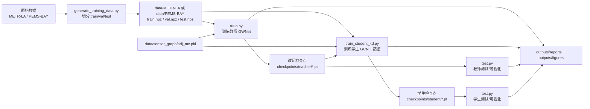
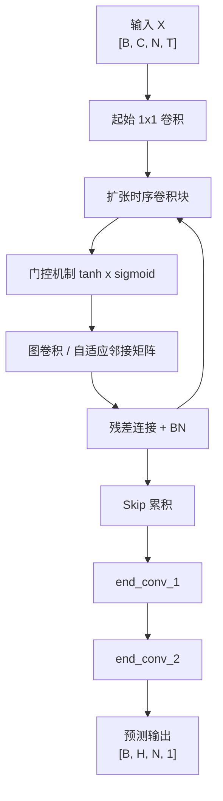
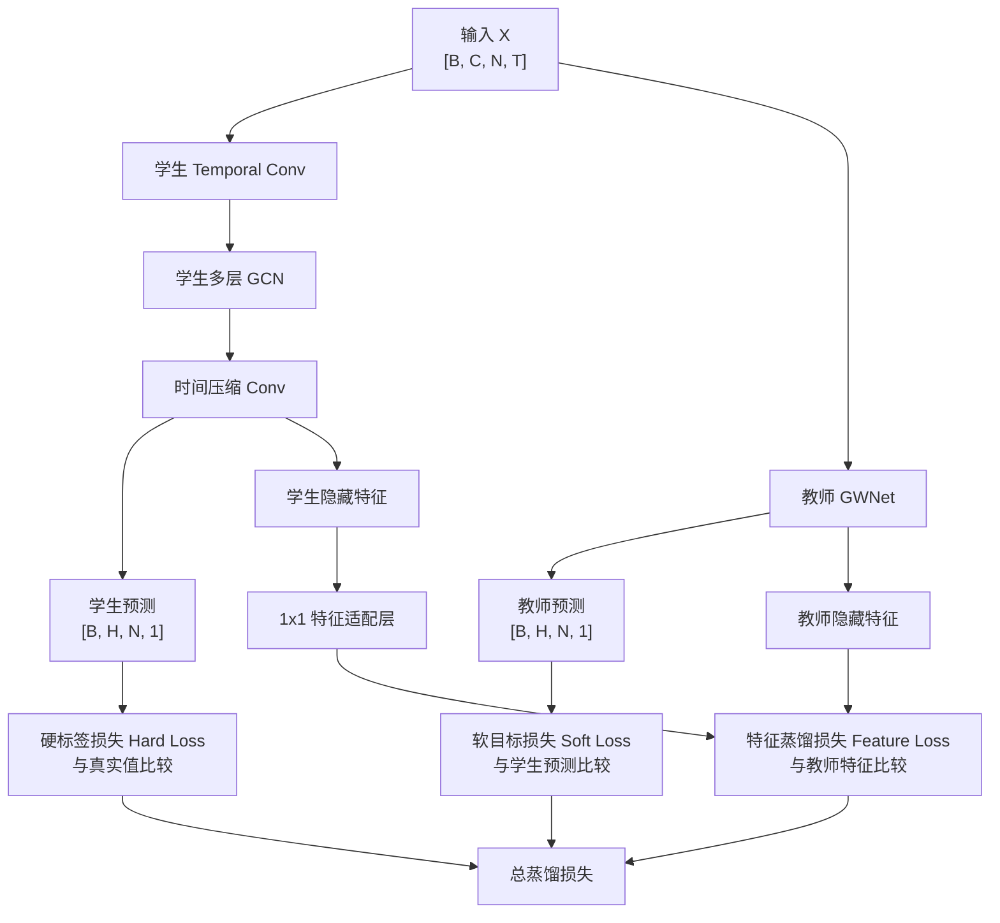

# GWNet-KD 模块结构图

## 1. 整体模块结构

## 2. 教师模型内部结构

## 3. 学生模型与蒸馏数据流

## 4. 关键张量维度

- 输入 `x` 原始维度：`[B, T_in, N, C_in]`
- 送入模型前转置后：`[B, C_in, N, T_in]`
- 教师输出：`[B, H_out, N, 1]`
- 教师输出转置后：`[B, 1, N, H_out]`
- 真实标签：`[B, N, H_out]`，扩维后为 `[B, 1, N, H_out]`
- 学生输出：`[B, H_out, N, 1]`
- 蒸馏比较时统一在 `[B, 1, N, H_out]` 空间下进行

