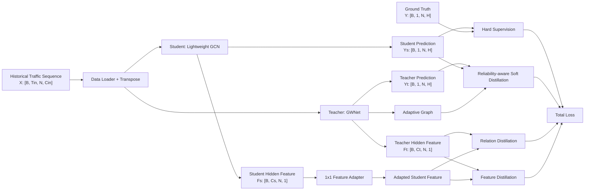
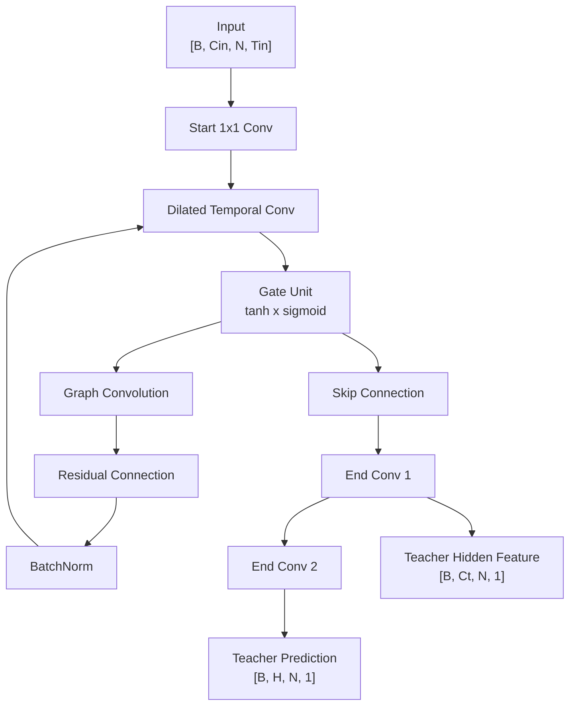
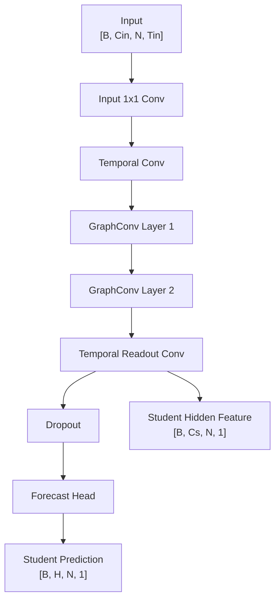
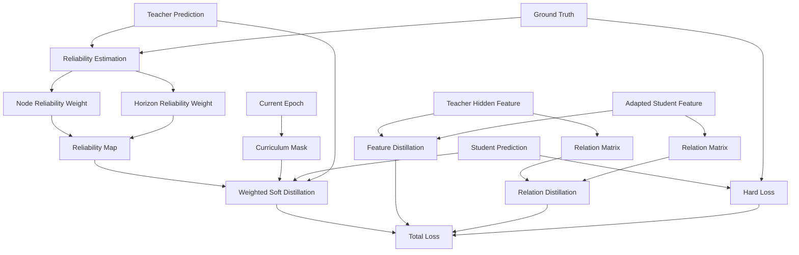
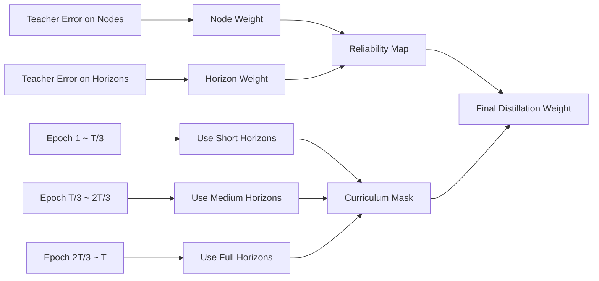
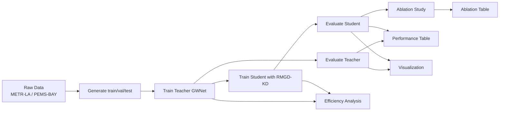
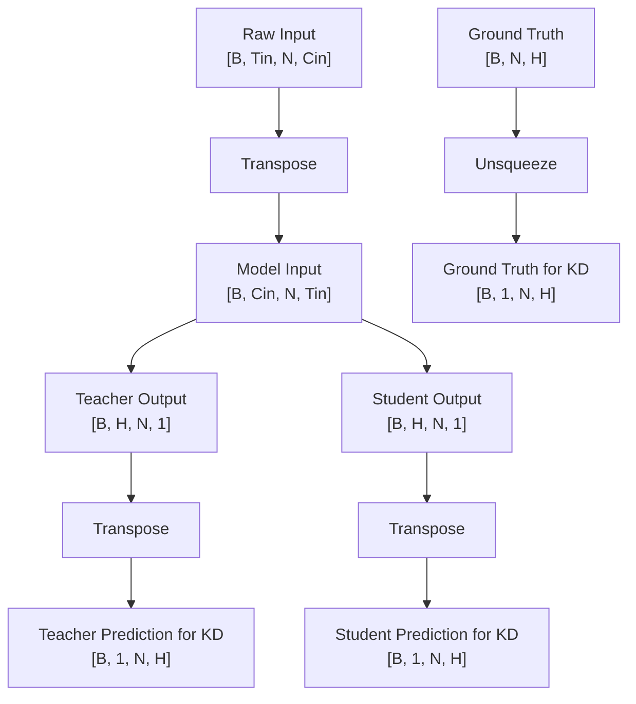

# 论文用结构图

这份文档专门给论文写作和制图使用。

建议你在论文中直接参考这里的图，再按期刊模板转成 Visio、ProcessOn、PowerPoint 或 draw.io 版本。

如果你后面需要，我也可以继续把这些图改成更偏论文风格的英文标注版。

## 图 1. 整体方法框架图

### 图注建议

可写成：

`图1  所提 RMGD-KD 方法整体框架。模型以 GWNet 作为教师，以轻量 GCN 作为学生，并通过可靠性加权软蒸馏、特征蒸馏和图关系蒸馏实现知识迁移。`

## 图 2. 教师模型 GWNet 结构图

### 图注建议

`图2  教师模型 GWNet 结构。教师模型通过扩张时序卷积和图卷积联合建模交通数据中的时空依赖关系。`

## 图 3. 学生模型 Light GCN 结构图

### 图注建议

`图3  轻量学生模型结构。学生模型采用浅层时空 GCN 设计，以减少参数量和推理开销。`

## 图 4. 蒸馏损失设计图

### 图注建议

`图4  多粒度蒸馏损失设计。所提方法联合考虑硬标签监督、可靠性加权软蒸馏、特征蒸馏和图关系蒸馏，并通过课程机制逐步扩展蒸馏范围。`

## 图 5. 可靠性加权与课程蒸馏示意图

### 图注建议

`图5  可靠性加权与课程蒸馏示意图。教师误差越小的位置被赋予更大的蒸馏权重，训练过程中蒸馏范围由短期预测逐步扩展到全 horizon。`

## 图 6. 实验流程图

### 图注建议

`图6  实验流程图。整个实验包含数据处理、教师训练、学生蒸馏训练、模型评估、消融实验、效率分析与可视化。`

## 图 7. 维度流图

### 图注建议

`图7  模型训练过程中的关键张量维度流。教师预测、学生预测和真实标签在蒸馏损失计算前统一整理到 [B, 1, N, H] 空间。`

## 推荐放进论文的图

如果篇幅有限，最建议保留这 4 张：

- 图1 整体方法框架图
- 图3 学生模型结构图
- 图4 蒸馏损失设计图
- 图7 维度流图

如果篇幅足够，可以再加：

- 图2 教师模型结构图
- 图5 可靠性与课程蒸馏示意图
- 图6 实验流程图

