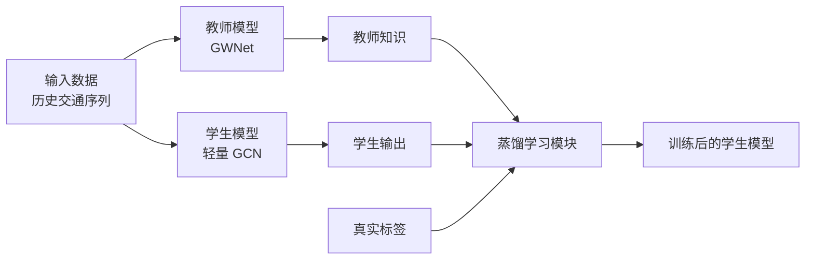
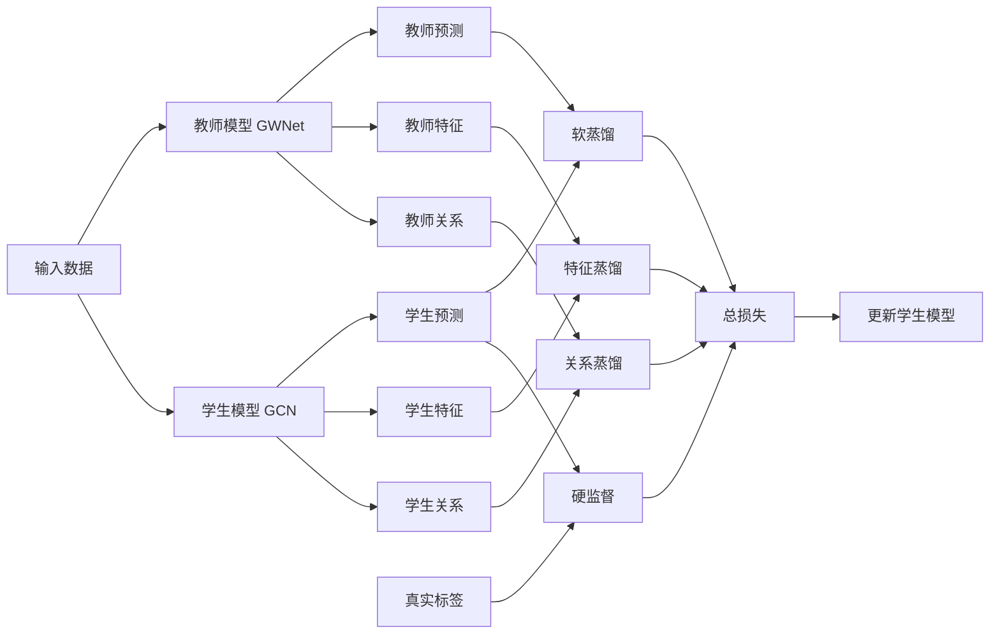
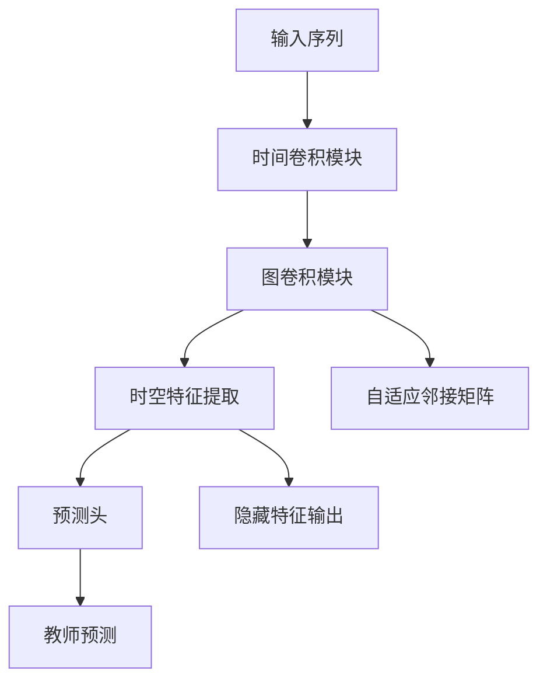
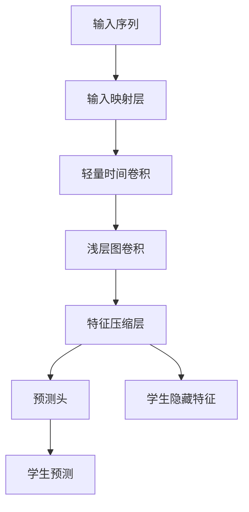
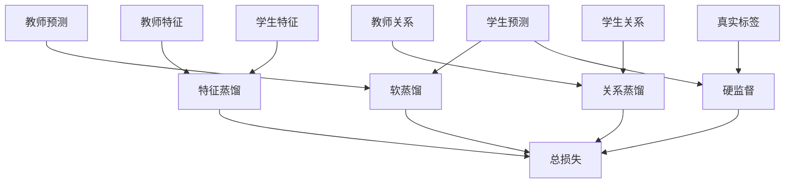
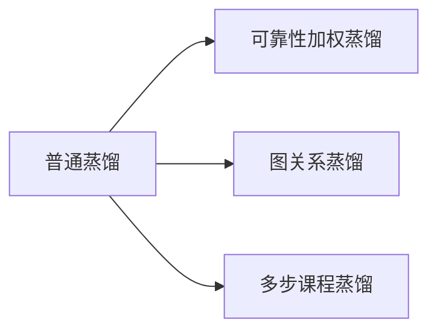
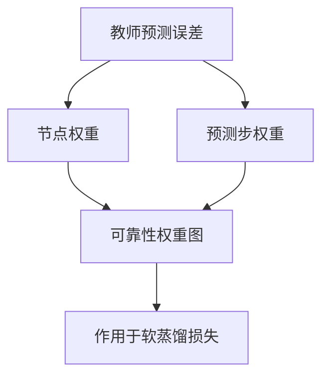
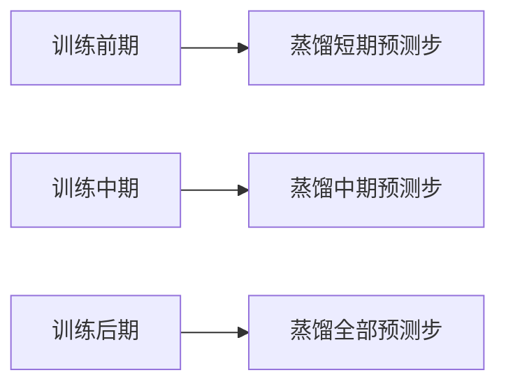
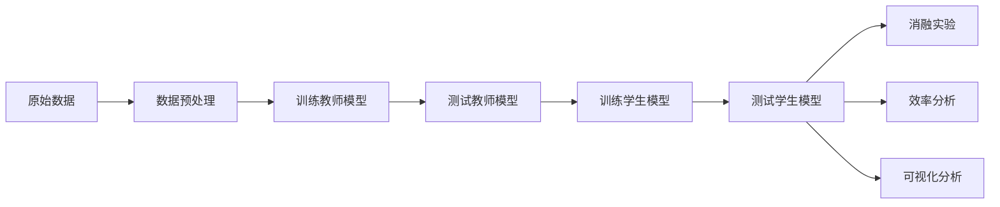

# 简洁版论文框架图（中文）

这份文档专门给你做“更容易画、线更少、更适合论文排版”的中文版结构图。

设计原则是：

- 先画“大模块相连”的总图
- 再分别画“教师模块”“学生模块”“蒸馏模块”“实验流程模块”
- 尽量减少交叉线
- 每张图都适合你在 `Visio / ProcessOn / draw.io / PPT` 里重新画

如果你要放论文，优先建议用这份，而不是之前那套线条较多的详细图。

---

## 图 1：整体框架总图

这张图最适合放在论文方法章节最前面。

### 图注建议

图 1 展示了本文方法的整体框架。历史交通序列同时输入教师模型与学生模型，教师输出的多粒度知识与真实标签共同用于指导学生模型训练，最终得到轻量化交通预测模型。

---

## 图 2：整体框架细化图

这张图比总图多一点细节，但仍然尽量保持清晰。

### 图注建议

图 2 展示了所提方法的主要组成部分。教师模型提供预测知识、特征知识和关系知识，学生模型在硬监督和多粒度蒸馏共同作用下完成训练。

---

## 图 3：教师模型结构图

这张图强调“教师是一个较强的时空模型”即可，不需要把所有卷积细节都画满。

### 模块细节建议写在图旁边

- 时间卷积模块：建模时间依赖
- 图卷积模块：建模空间依赖
- 自适应邻接矩阵：学习动态空间关系
- 隐藏特征输出：供后续蒸馏使用

---

## 图 4：学生模型结构图

这张图突出“轻量化”即可。

### 模块细节建议写在图旁边

- 输入映射层：统一输入通道
- 轻量时间卷积：低成本建模时间变化
- 浅层图卷积：提取节点空间信息
- 特征压缩层：减少参数量和推理开销

---

## 图 5：蒸馏模块结构图

这张图最适合放在方法章节“蒸馏策略”部分。

### 图注建议

图 5 展示了本文采用的多粒度蒸馏设计，包括输出层软蒸馏、特征层蒸馏、关系层蒸馏以及真实标签监督。

---

## 图 6：创新点模块图

这张图很适合专门解释你的三个创新点。

### 你可以在图旁边写的说明

- 可靠性加权蒸馏：
  根据教师在不同节点和不同预测步上的误差，自适应调整蒸馏权重

- 图关系蒸馏：
  通过节点关系矩阵迁移教师学习到的空间依赖结构

- 多步课程蒸馏：
  按照由易到难的方式逐步扩大蒸馏的预测步范围

---

## 图 7：可靠性加权蒸馏示意图

这张图单独画出来很清楚，也很适合论文。

### 图注建议

图 7 展示了可靠性加权蒸馏机制。教师在不同节点和不同预测步上的误差被用于构造权重图，从而增强可靠知识的蒸馏强度。

---

## 图 8：多步课程蒸馏示意图

### 图注建议

图 8 展示了多步课程蒸馏策略。随着训练推进，蒸馏范围由短期预测逐步扩展到全部预测步，以提高训练稳定性。

---

## 图 9：实验流程图

这张图适合放实验部分前面。

### 图注建议

图 9 展示了本文实验流程，包括数据处理、教师训练与测试、学生蒸馏训练与测试，以及后续的消融实验和效率分析。

---

## 图 10：你最推荐真正放进论文的 4 张图

如果你不想放太多图，最推荐这 4 张：

1. 图 1：整体框架总图  
2. 图 3：教师模型结构图  
3. 图 4：学生模型结构图  
4. 图 5：蒸馏模块结构图  

如果还想再突出创新点，再加：

5. 图 7：可靠性加权蒸馏示意图  
6. 图 8：多步课程蒸馏示意图  

---

## 图 11：推荐排版方式

如果你用画图软件重画，建议按下面方式排：

- 第一张：总图
- 第二张：教师和学生并排
- 第三张：蒸馏模块图
- 第四张：创新点小图并排

这样比把所有细节塞进一张图里更清楚。

---

## 一句话总结

这份文档适合你直接照着重画论文图：

- 总图负责讲清楚全貌
- 子图负责讲清楚局部模块
- 创新点单独画，避免一张图里线太多
